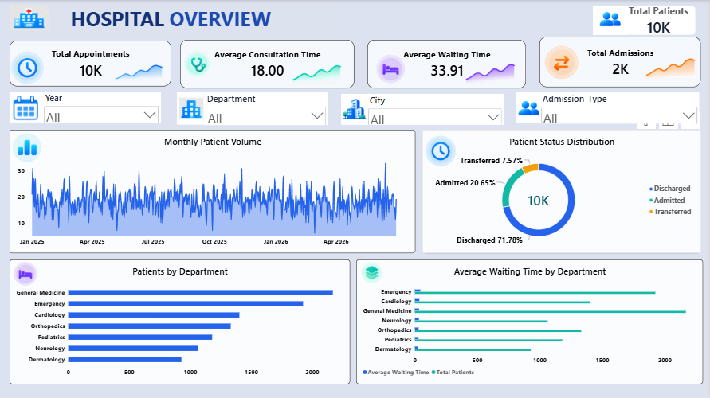
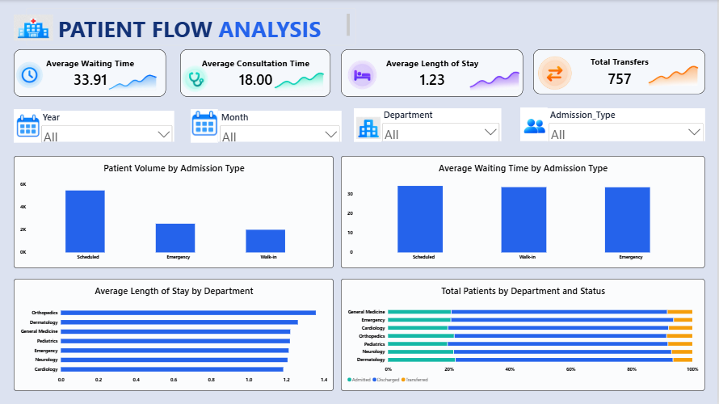
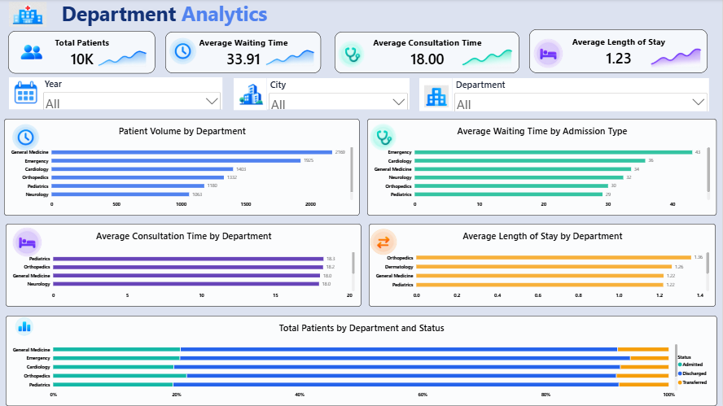

# Hospital Operations & Patient Flow Analytics

## Overview

A data analytics project designed to analyze hospital operational
data and identify trends related to patient volume, department
workload, waiting time, consultation time, admissions and patient flow.

The project uses Python, Pandas, MySQL, SQL and Power BI.

---

## Tech Stack

- Python
- Pandas
- MySQL
- SQL
- Power BI
- DAX

---

## Project Workflow

Raw Dataset
↓
Python + Pandas
↓
Data Cleaning & EDA
↓
MySQL
↓
SQL Analysis
↓
Power BI
↓
DAX Measures
↓
Interactive Dashboard
↓
Business Insights

---

## Dataset

The dataset contains 10,020 initial records.

After data cleaning:

- 10,000 records
- 18 columns
- Duplicate records removed
- Missing values handled
- Date fields converted
- Age groups created
- Year and month features created

### Dataset Disclaimer

This project uses synthetic data created for educational
and portfolio purposes.

It does not contain real patient information or real hospital records.

---

## Python / Pandas

Python was used for:

- Data loading
- Data inspection
- Missing-value analysis
- Duplicate detection
- Date conversion
- Missing-value handling
- Feature engineering
- Exploratory data analysis

Main file:

`python/cleaning_eda.py`

---

## SQL Analysis

MySQL was used to perform analytical queries including:

- Patient volume by department
- Average waiting time
- Average consultation time
- Average length of stay
- Patient volume by city
- Admission type analysis
- Patient status analysis
- Monthly patient volume
- Department-level analysis
- CTEs
- RANK()
- DENSE_RANK()
- LAG()
- Month-over-month analysis

Main file:

`sql/hospital_analysis.sql`

---

## Power BI Dashboard

The Power BI report contains three pages.

### 1. Hospital Overview

Includes:

- Total Patients
- Total Appointments
- Average Waiting Time
- Total Admissions
- Monthly Patient Volume
- Patients by Department
- Patient Status Distribution
- Interactive filters

---

### 2. Patient Flow Analysis

Includes:

- Average Waiting Time
- Average Consultation Time
- Average Length of Stay
- Total Transfers
- Patient Volume by Admission Type
- Waiting Time by Admission Type
- Length of Stay by Department
- Patient Status by Department

---

### 3. Department Analytics

Includes:

- Patient Volume by Department
- Average Waiting Time by Department
- Average Consultation Time by Department
- Average Length of Stay by Department
- Department Status Distribution

---

## Key Skills Demonstrated

### Python
- Pandas
- Data Cleaning
- Exploratory Data Analysis
- Feature Engineering

### SQL
- SELECT
- WHERE
- GROUP BY
- HAVING
- Aggregate Functions
- CTE
- Window Functions
- RANK
- DENSE_RANK
- LAG

### Power BI
- Data Modeling
- DAX
- KPI Cards
- Slicers
- Interactive Dashboards
- Data Visualization

---

## Project Objective

The objective of this project is to transform raw hospital
operational data into actionable analytical insights using
Python, SQL and Power BI.

---

## Author

SOUNDARIYA GAYAKWAD